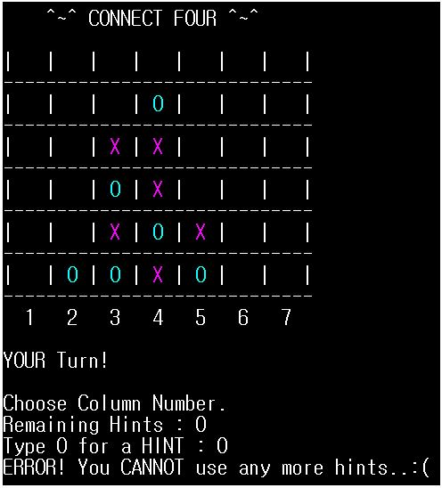
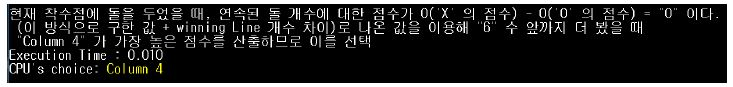

# Connect Four Using AI

CONNECT FOUR 게임을 AI 와 대결할 수 있도록 구현한 프로젝트. 플레이하기 전 AI 의 수준을 선택하여 대결할 수 있음.

<b><i>Language: C++, OS: Windows</i></b>

### Description
- <b>Alpha Beta Pruning</b> 을 사용하여 <b>MinMax Algorithm</b> 의 시간복잡도를 낮춤. AI 가 최대한 많은 탐색을 하여 최적의 선택을 할 수 있도록 함.
- 각 노드를 탐색할 때 마다 `getScore` 라는 함수를 이용하여 board 의 상태에 따라 heuristic 점수를 부여하였음. 
- Depth 를 하나씩 늘려가며 DFS 를 통해 탐색. 최대 탐색 depth 에 따라 AI 의 수준이 달라짐.
- `findMaxHeuristic` 함수를 이용해서 사용자는 힌트를 사용할 수 있음. `findMaxHeuristic` 함수는 AI 가 탐색하는 과정에서 쓰이기도 함.
- 선공/후공을 결정할 수 있음.
 
 

 
### Heuristic
- turn 이 충분히 증가하기 전까지는 각 column 마다 heuristic 값이 동일하거나 유사하여 column 별로 heuristic 값이 구별되도록 연속된 돌의 개수에 따라 다른 점수를 부여하는 `sequenceScore` 구현.
- `sequenceScore` 에서는 일렬로 연속되어 놓이는 돌의 개수가 많을수록 점수를 더 많이 부여. 
- 계산한 `sequenceScore` 값에 `winning line` 의 수를 더하여 두 플레이어의 점수를 계산하고, 그 값의 차이로 heuristic 점수를 도출.
 
 

  

